   
  # Chukl - The Social Media API 
  ## **Description**
  This project is an application that includes the basic back-end database structure for a social media API, including users, comments and replies. Using MongoDB as our database, and Mongoose as a structure for validation, the database allows for versatility in future projects, while remaining within constraints set by future developers.

  So prepare for a riot (of laughter) when you integrate this API into your next social media application as the building blocks to bring people together.

 

  ---

  ## **Table of Contents**
  * [Installation](#installation)
  * [Usage](#usage)
  * [Create](#create)
    * [User](#create-user)
    * [Thought](#create-thought)
    * [Friend](#create-friend)
    * [Reaction](#create-reaction)
  * [Read](#read)
    * [User](#read-user)
      * [All](#all-users)
      * [ID](#users-by-id)
    * [Thought](#read-thought)
      * [All](#all-thoughts)
      * [ID](#thoughts-by-id)
  * [Update](#update)
    * [User](#update-user)
    * [Thought](#update-thought)
  * [Delete](#delete)
    * [User](#delete-user)
    * [Thought](#delete-thought)
    * [Friend](#delete-friend)
    * [Reaction](#delete-reaction)
  * [Credits](#credits)
  * [License(s)](#license)
  * [Contributers](#contributers)
  * [Questions](#questions)
   
  ---

  ## **Installation**
  To install the Chukl API, clone the repository and enter 'npm i' in the terminal while at the root directory

   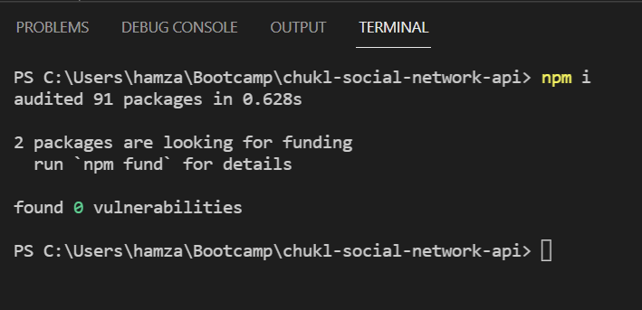

  ---

  ## **Usage**
 The Chukl API allows you to create users, thoughts (comments) and reactions (replies) in the backend, to prepare for incoming data from your front end project. To verify it works, having a user friendly method to view backend CRUD calls and responses is the simplest way to check. [Insomnia](https://insomnia.rest/) is a great application to verify such calls. We can start by creating a user. 

---
## Create
---
### **Create User**
---
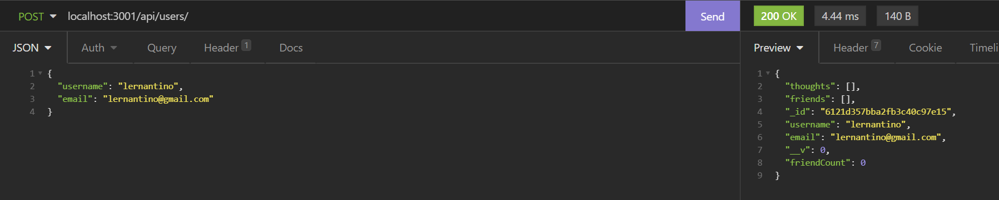

To create a new user, in the URL or fetch call, direct to /api/users/  as a POST method call as seen above in the top left. In our API, to user required a username, and email address. The email and username must be unique for each instance created. on the right you can see the response was sucessful and returns the user a unique id as well as the number of thoughts or comments the user has based on the ID of the comment, as well as the number from friends the user has basaed on other users IDs. The email address also uses a regex expression ot verify that the local local, domain(@yahoo) and top level domain (.com) are also correct such was local@yahoo.com

The correct format for the JSON is as follows:
> {
>   username: \<String>
    email: \<String@string.com>
>}
---
### **Create Thought**
---
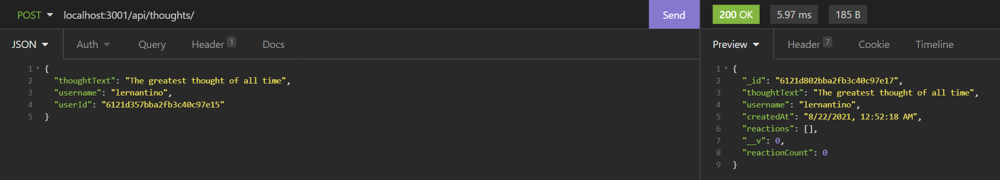
---

To create a new thought, in the URL or fetch call, direct to /api/thoughts/  as a POST method call as seen above in the top left. In our API, a thoughtText and username is required, and a userID must be used to reference which use is actually making the thought. This will also update the user object by appending the array of thoughts that user made based on the ID of the thought as seen below.

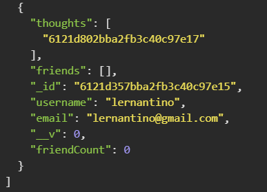

The correct JSON format is as follows: 

>{
>   thoughtText: \<String>
>   username: \<String>
>   userId: \<String> **Must match a valid user ID that exist in the database**
>}

---
### **Create Friend**
---
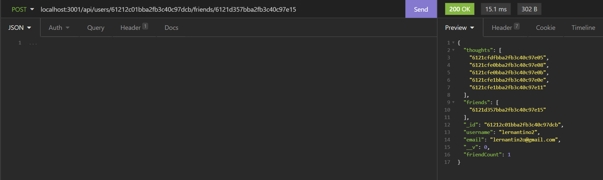
---
To create a new friend reference, in the URL or fetch call, direct to /api/users/:id/friends/:friendId  as a POST method call, where :id refers to the user within the user database who will be receiving the new friend, and friendId refers to the user who will befriend the user. It will push a reference to the friends user ID to the user's 'friends' array. This will give a reference to all friends of the user. There is no JSON required in the body because the POST will occur based on the parameters of :id and :friendId in the parameters of the URL.

---
### **Create Reaction**
---
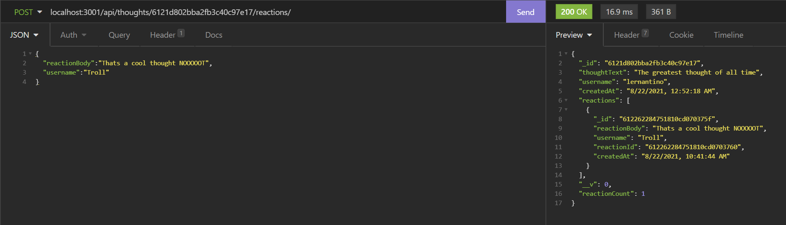
---
To create a new reaction, in the URL or fetch call, direct to /api/thoughts/:thoughtId/reactions as a POST method call, where :thoughtId refers to the thought's id you wish to add a reaction or reply to. The thoughts will also have a counter to the number of reactions that a user has recieved when we look at the object below. 

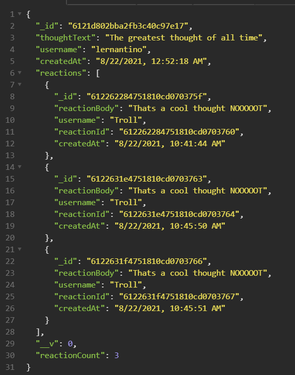

The correct JSON format is as follows: 

>{
>   reactionBody: \<String>   
>   username: \<String>
>}

---
## Read
---
### **Read User**
---
#### **All Users**
---
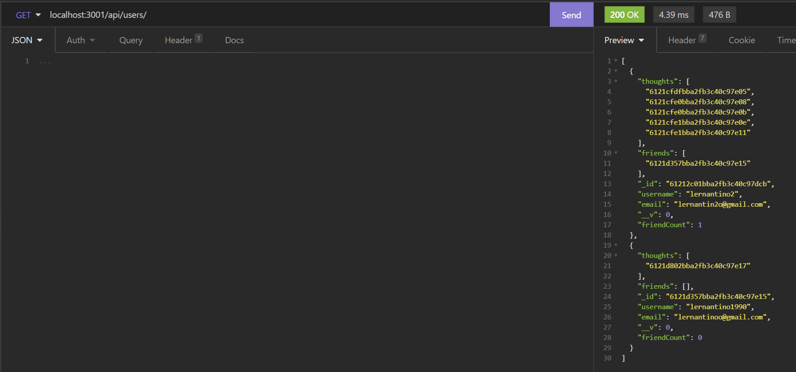
---
If you want to view all users that have been created, in the URL or fetch call, direct to /api/users/ and perform a GET method. This should return all current users within the database. 

---
#### **Users By ID**
---
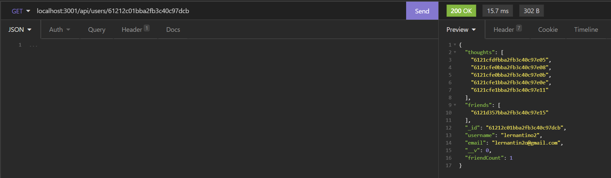
---
If you want to view a specific user, in the URL or fetch call, direct to /api/users/:id and perform a GET method where :id refers to the user you wish to return the information of. This should return a user with the matching id from the URL parameter. 

---
### **Read Thought**
---
#### **All Thoughts**
---
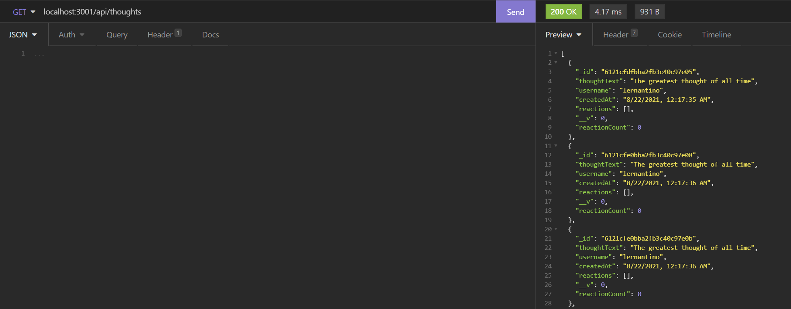
---
If you want to view all thoughts that have been created, in the URL or fetch call, direct to /api/thoughts/ and perform a GET method. This should return all current thoughts and their reactions within the database. 

---
#### **Thoughts By ID**
---
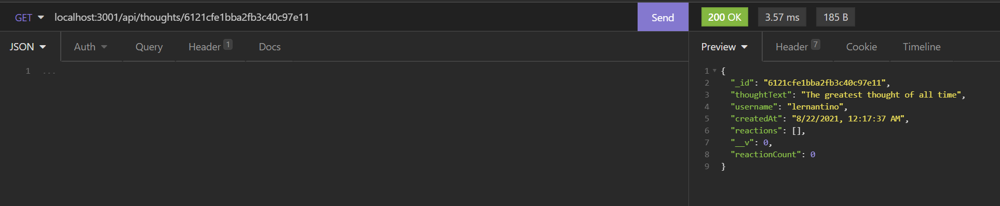
---
If you want to view a specific thought0, in the URL or fetch call, direct to /api/thoughts/:id and perform a GET method where :id refers to the thought you wish to return the information of. This should return a thought with the matching id from the URL parameter. 

---
## Update
---
### **Update User**
---
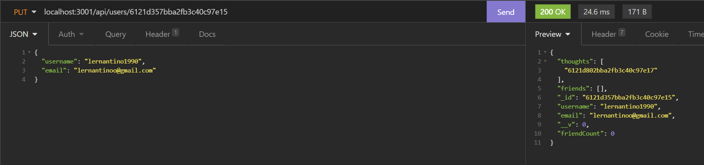
---
To update a user's email or username, in the URL or fetch call, direct to /api/users/:id as a PUT method, where :id refers to the the user id in which you update that particular user's information. The information must still be unique to the rest of the users in the server and does not affect the friends or thoughts array. The correct JSON format is as follows:

>{
>  username: \<String>,
>  email: \<String>
>}
>
The email must continue to follow standards of including a local address, domain and top level domain to be considered valid, and you can change either username, email or both username and email at the same time. 

---
### **Update Thought**
---
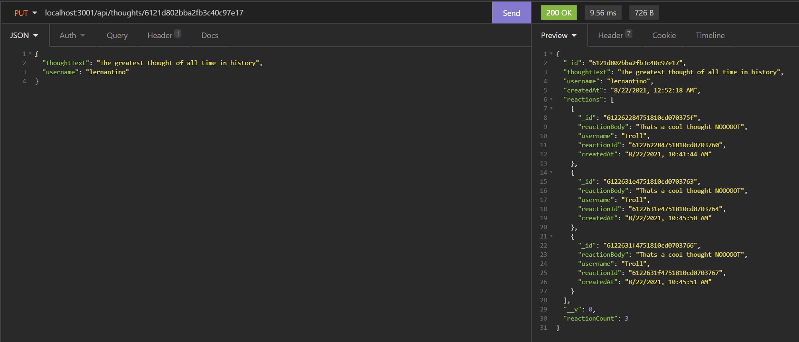
---

To update a thought text or the username referencing it, in hte URL or fetch call, direct to /api/thoughts/:thoughtId as a PUT method, where :thoughtId references the thought information you wish to update. The correct JSON format is as follows:

>{
>  thoughtText: \<String>
>  username: \<String>
>}

The username that is changed within this thought, will not change the username of the original user who created the thought, rather the username defined in the [thought](#create-thought) POST rather then the [user](#create-user) POST.

---
## Delete
---
### **Delete User**
---
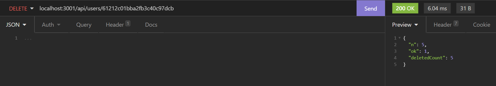
---

To delete a user, in the URL or fetch call, direct to /api/users/:id as a DELETE method, where :id refers to the user's id referencing the user you wish to delete. If the user has any thoughts they had made in the past, it will also delete those values and return the number of thoughts it deleted. 

---
### **Delete Thought**
---
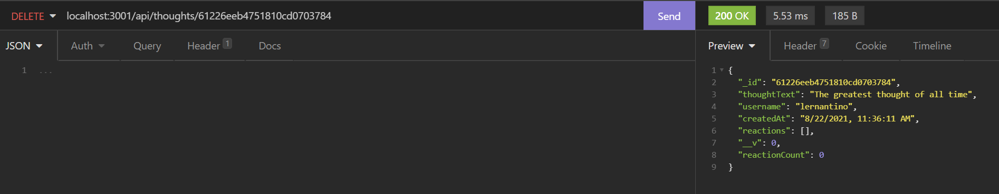
---

To delete a thought, in the URL or fetch call,  direct to /api/thoughts/:id as a DELETE method, where :id refers to the thought's id referencing which thought you wish to delete. If the user has any reactions within the thought, those reactions will also be deleted. 

---
### **Delete Friend**
---
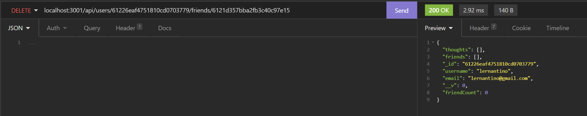
---

To delete a friend from a user, in the URL or fetch call, direct to /api/users/:id/friends/:friendId as a DELETE method, where :id refers to which user's friends list, and :friendId refers to a friendID they wish to delete. If a friend is deleted, the user will remain within the system, and its reference will be removed from the list.

---
### **Delete Reaction**
---
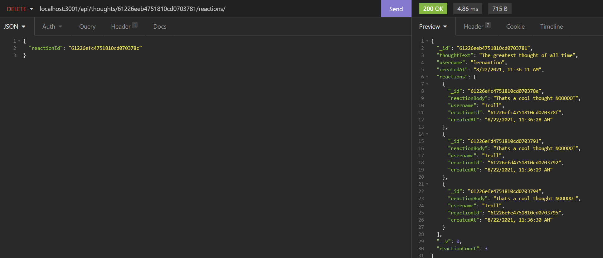
---

To delete a reaction from a thought, in the URL or fetch call, direct to /api/thoughts/:id/reactions as a DELETE method, where :id refers to the thought's id which you are referencing. In this component, a JSON is required to determine which reply you wish to remove. The correct JSON format is as follows:

>{
> reactionId: \<String> 
>}

The reactionId is a seperate Id from Mongo's _id parameter from the model, so be sure you select the correct id, otherwise the deletion will fail ot complete 

  ## **Credits**
  Hamzah Ullah

  ---

  ## **License**
  1 license used:
 [MIT](https://choosealicense.com/licenses/mit/)
 

  ---

  ## **Contributers**
   Contributing to the Project is Restricted 

  ---

  ## **Questions?**

  Check out our youtube video of our API in action [here](https://youtu.be/bsZWSUiCA-w) or the picture below:

  

  ### **Github**
  [Repository](https://github.com/brobro10000)

  [Personal Page](https://brobro10000.github.io)

  If you have any questions, you can reach me at <hamzahullah@gmail.com>
